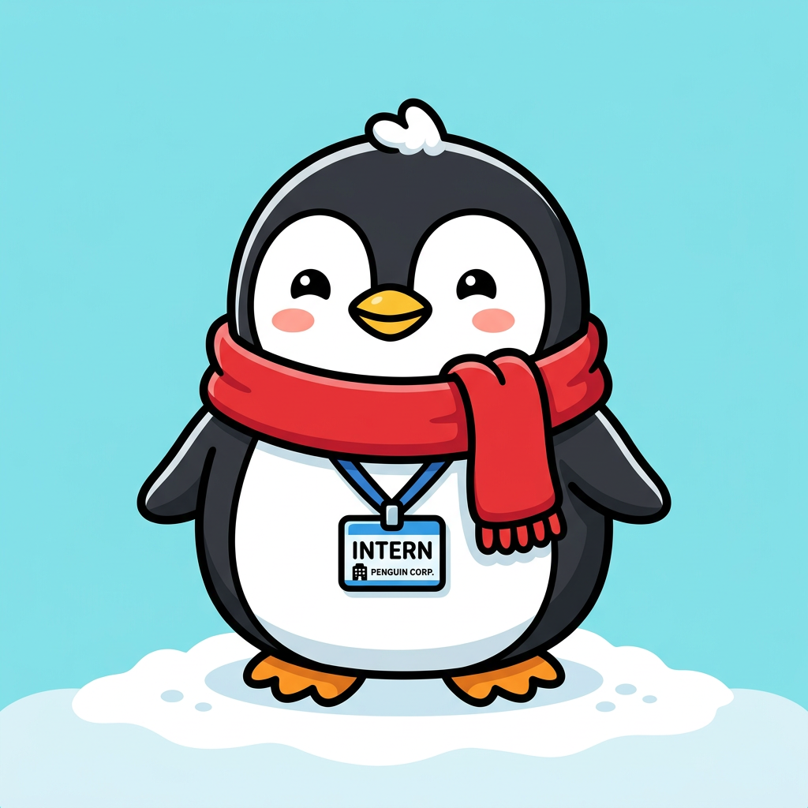
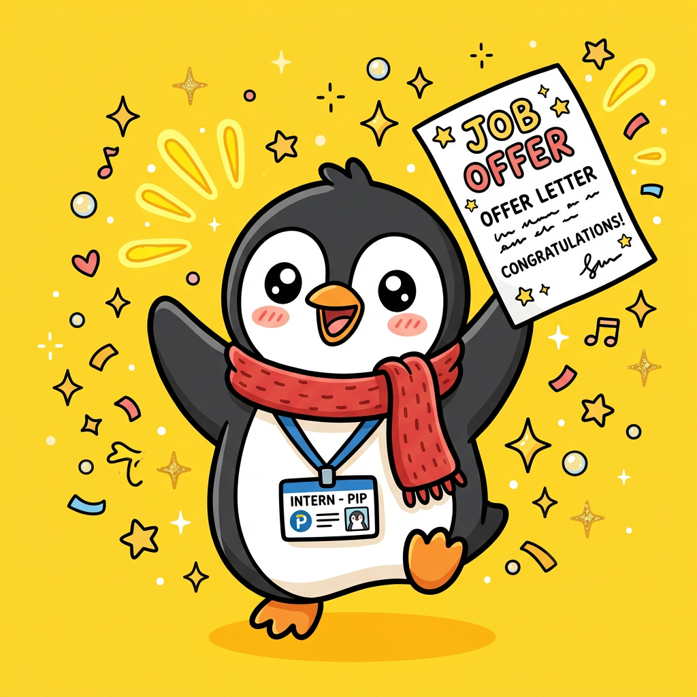
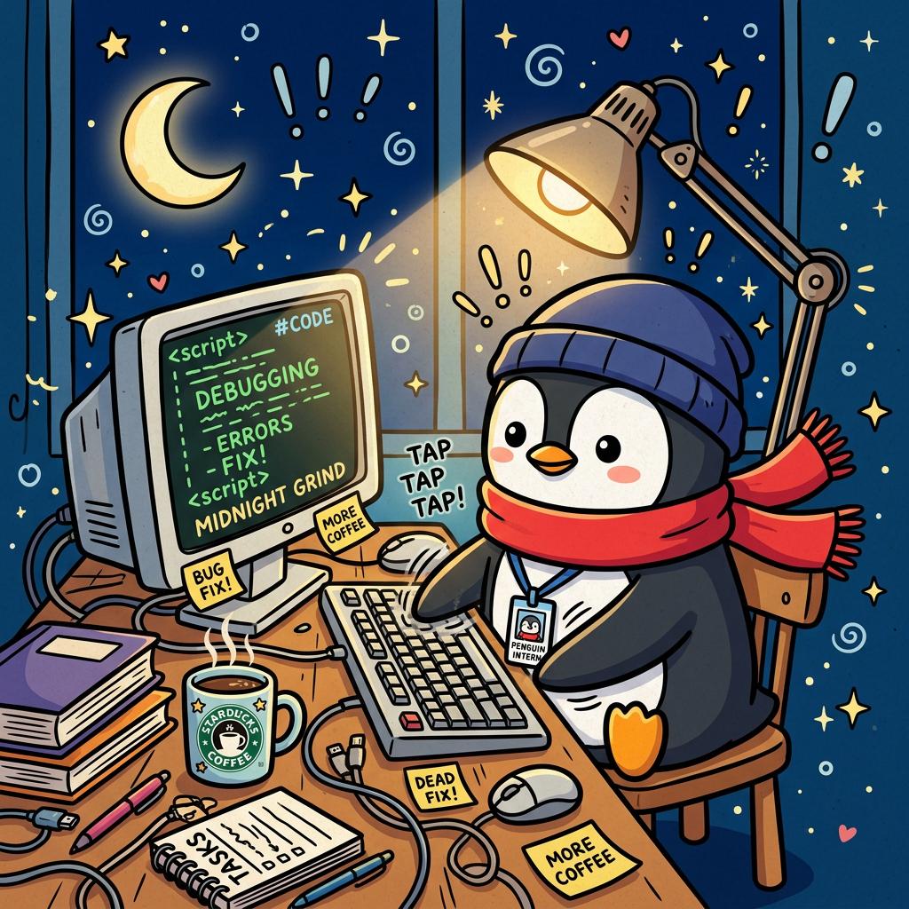

<!-- 顶部 banner：用 readme-typing-svg 做一个打字机标题 -->
<div align="center">

<a href="https://github.com/theAtlantic-zza/Tencent-Intern-Penguin-Survival-Story">
  
</a>

# 🐧 鹅厂实习记

[](./LICENSE)
[](https://react.dev/)
[](https://www.typescriptlang.org/)
[](https://vitejs.dev/)
[](https://tailwindcss.com/)

[](https://github.com/theAtlantic-zza/Tencent-Intern-Penguin-Survival-Story/stargazers)
[](https://github.com/theAtlantic-zza/Tencent-Intern-Penguin-Survival-Story/commits/main)

[**📦 部署上线指南**](./DEPLOY.md) · [**🐛 提个 issue**](https://github.com/theAtlantic-zza/Tencent-Intern-Penguin-Survival-Story/issues) · [**🌟 给个 Star**](https://github.com/theAtlantic-zza/Tencent-Intern-Penguin-Survival-Story)

</div>

---

## 🎬 这是一个怎样的游戏

> 你是一只刚入职鹅厂的实习企鹅。
> 12 周（或 24 周）的实习期里，每周一件事，每件事三个选择，
> 你的每一次按下"确定"，都会改变这一世的走向。

它不长，一局十几分钟；
它不深，但每个选项都能让你笑出声或叹口气；
它不严肃，但你会在某个瞬间想起自己的那段实习。

## ✨ 玩法亮点

<table>
<tr>
<td width="50%" valign="top">

### 🎲 每周三选一
不是单线推进，每周给你 **3 张候选事件**——
吃黄焖鸡？开会摸鱼？还是半夜处理 P0 故障？
**选了就回不去了**，另外两件不会再来。

### 🐧 5 个职业 × 5 个天赋
入职选职业（产品/设计/研发/运营/职能），
开局抽 3 选 1 通用天赋（学霸 / 嘴炮王 / 卷王 / …）
**25 种开局组合**，每一局都新鲜。

### 📜 每个选择都有故事
不是冷冰冰的 "+3 智力 -1 体力"，
**每个选项后都有一段原创旁白**——
"九宫格已发，配文：「鹅厂第一天，启程！」高中同学集体来点赞。"

</td>
<td width="50%" valign="top">

### 🏆 10 种结局
从 💀 过劳猝死到 🏆 王牌实习生，
从 💸 弹尽粮绝到 💎 财富自由，
**你的每个选择都在悄悄决定你的结局**。

### ⚔️ 完整鹅生：24 周 + 晋升副本
选「完整版」解锁 **11 个晋升副本事件**：
PIP、组织架构调整、年会 keynote、VP 1on1……
**真实职场的浓缩样本**。

### 🎒 全套现代游戏体验
- 打字机文案 / 数字滚动 / 大插图卡片
- 4 类音效（可静音） / 截图分享结局海报
- localStorage 持久化 / 转生计数 / 历世记录
- 8 个成就 + 图鉴系统（带触发提示）

</td>
</tr>
</table>

## 📸 截图预览

<div align="center">

| 首页 | 选职业 | 游戏内 |
|:---:|:---:|:---:|
|  |  |  |
| 大插画 + 实时数据面板 | 5 职业差异化属性 | 大图卡片 + 三选一事件 |

</div>

## 🚀 快速开始

```bash
# 1. 克隆
git clone https://github.com/theAtlantic-zza/Tencent-Intern-Penguin-Survival-Story.git
cd Tencent-Intern-Penguin-Survival-Story

# 2. 装依赖（需要 Node 18+）
npm install

# 3. 跑起来
npm run dev
```

打开 `http://127.0.0.1:5173/` 即可开玩。

## 🛠 技术栈

| 层 | 选型 | 为什么 |
|---|---|---|
| 构建 | **Vite 5** | 启动 200ms，HMR 飞快 |
| 框架 | **React 18 + TypeScript（strict）** | 类型安全 + 组件化 |
| 样式 | **Tailwind CSS 3** | 原子化，写得快 |
| 状态 | **Zustand 4 + persist** | 比 Redux 轻，比 Context 清晰 |
| 截图 | **html2canvas** | 一键导出结局海报 |
| 音效 | **WebAudio API** | 实时合成，零资源 |
| 部署 | **EdgeOne Pages / Vercel** | 都免费，国内首选 EdgeOne |

## 📦 数据量

```
🎭 41 个事件     ·    🛤 10 个结局
🎯 8 个成就     ·    🐧 5 个职业
✨ 5 个天赋     ·    🎨 8 张原创插画
📝 ~120 个原创选项旁白
```

## 🗂 项目结构

```
src/
├── App.tsx                       # 阶段路由（home/naming/.../ended）
├── main.tsx, index.css           # 入口 + Tailwind
│
├── components/                   # 通用组件
│   ├── Logo.tsx                  # 鹅厂实习记 标题
│   ├── Button.tsx, Card.tsx      # 基础 UI
│   ├── AttrPanel.tsx             # 6 维属性 + 转正进度 + 周数倒计时
│   ├── CollectionModal.tsx       # 图鉴弹窗（进度环 + 网格）
│   ├── useTypewriter.ts          # 打字机 hook
│   └── useAnimatedNumber.ts      # 数字滚动 hook
│
├── screens/                      # 7 个阶段页
│   ├── HomeScreen.tsx            # 首页（hero + 数据面板 + 历世记录）
│   ├── NamingScreen.tsx          # 取名（含沙雕随机）
│   ├── DifficultyScreen.tsx      # 标准 12 周 / 完整 24 周
│   ├── ChoosingScreen.tsx        # 5 职业 + 起始属性 + 独门天赋
│   ├── TalentScreen.tsx          # 通用天赋三选一
│   ├── PlayingScreen.tsx         # 游戏内（三选一 + 事件详情 + outcome 旁白）
│   └── EndedScreen.tsx           # 结算页（截图分享）
│
└── game/                         # 游戏数据与逻辑
    ├── types.ts                  # 全部类型
    ├── store.ts                  # Zustand 主循环
    ├── tracks.ts, professions.ts, talents.ts
    ├── events.ts                 # 41 个事件 + ~120 个 outcome
    ├── endings.ts                # 10 结局 + 8 成就
    ├── nameGen.ts, sfx.ts
```

## 🎨 设计原则

本项目遵循极简的协作规范：

> **1. Think Before Coding** — 实现前先暴露假设，多解法时不静默选择
> **2. Simplicity First** — 不做超出需求的"灵活性"
> **3. Surgical Changes** — 只改要改的，不顺手"美化"无关代码
> **4. Goal-Driven Execution** — 把任务转成可验证目标，循环到通过

## 🌱 怎么部署上线

详见 👉 [**DEPLOY.md**](./DEPLOY.md)

| 平台 | 国内速度 | 自动部署 | 我的推荐 |
|---|---|---|---|
| **EdgeOne Pages** | ⚡ 飞快 | ✅ push 即部署 | 🏆 |
| Vercel | 🐢 慢 | ✅ push 即部署 | 国外用户 |
| GitHub Pages | 🐢 不稳 | ✅ workflow | 不推荐 |

## 🚧 路线图

- [x] 取名 + 5 职业选择 + 难度档
- [x] 41 事件 + 10 结局 + 8 成就
- [x] 5 职业独门天赋 + 5 通用天赋
- [x] 三选一周事件 + outcome 旁白
- [x] 截图分享 + 音效 + 打字机 + 数字滚动
- [x] 图鉴系统（进度环 + 网格 + 触发提示）
- [ ] 5 个隐藏结局（和导师开公司 / 被挖去对家 / 躺平做主播 …）
- [ ] 重摇机会（每局 1 次重抽事件）
- [ ] 1~2 条事件链（连续 2~3 周的剧情）
- [ ] 在线排行榜 / 朋友 PK
- [ ] PWA 支持

## 🙏 致敬 & 鸣谢

- 灵感：《人生重开模拟器》、社区版《鹅厂求生记》
- 视觉：基于 AI 共创的卡通插画（红围巾 + INTERN 工牌的小企鹅形象）
- 文案：100% 原创鹅厂打工梗，仅供学习交流，**不代表任何雇主立场**

## 📄 License

[MIT](./LICENSE) © 2026 theAtlantic-zza

<div align="center">

---

**如果这个项目让你笑了一下，给个 Star 就是最大的鼓励 ⭐**

<sub>「欢迎加入鹅厂，一起开心工作 认真生活」—— 然后呢？</sub>

</div>
